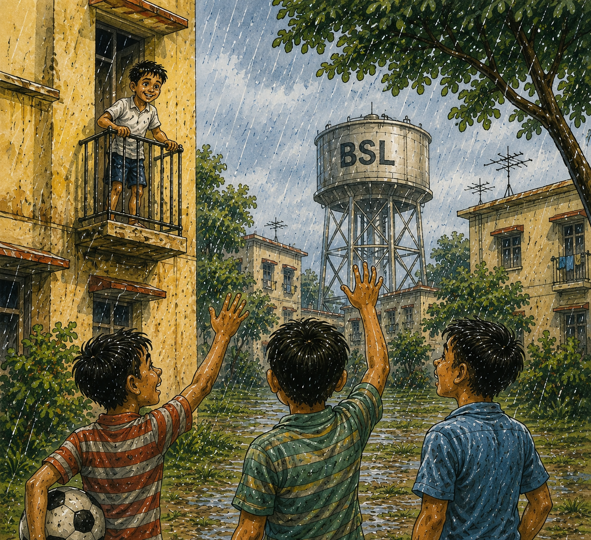
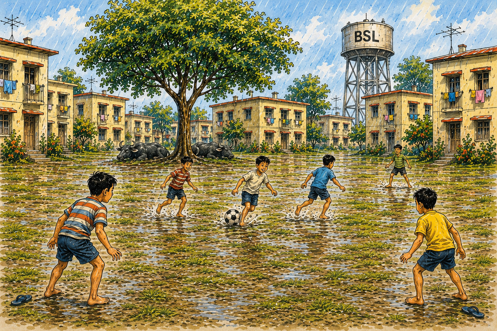
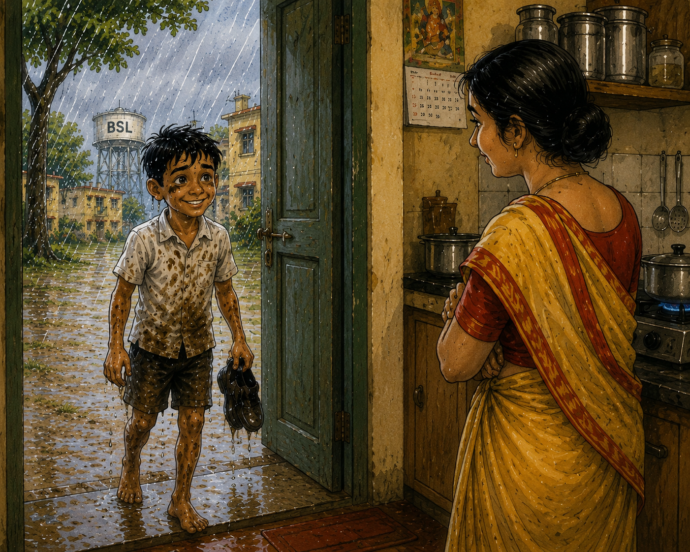

# The day rain gave them the field

The playground sat in the middle of the government quarters like a village square.

On most evenings it belonged to the older boys.

They arrived in groups, occupied the best part of the field, and played football with such authority that younger boys rarely got much time with the ball. Venkat and his friends would run, tackle, and occasionally receive a pass, but the game always seemed to happen around them rather than with them.

That evening, however, the rain had other plans.

A steady monsoon shower had been falling since late afternoon.

Venkat stood by the window, watching sheets of rain drift across the playground. The field had turned lush and green over the past few weeks. Puddles sparkled in the low patches. Beneath the large rain tree at the centre of the ground, a pair of buffaloes appeared to be enjoying the weather as much as anyone could.

The playground was empty.

Not a single older boy was in sight.

Then came a familiar shout from below.

“Venkat!”

He leaned out of the window.

Das stood in the rain with a football tucked under one arm. Beside him was Chatterjee, already soaked.

“Coming or not?” shouted Das.

Venkat laughed.

“In this rain?”

“Especially in this rain!”

Chatterjee pointed dramatically toward the deserted playground.

“Look. The whole ground is empty.”

Das grinned.

“Babtu and Monty are coming. We’re picking up Bittu on the way.”

For a moment Venkat stared at the empty field.

An entire football ground.

No older boys.

No waiting.

No watching from the sidelines.

The decision took less than a second.

“Two minutes!” he shouted.

Then he disappeared from the window.

---

By the time all six boys gathered near the playground, the rain had become heavier.

The football was placed on the wet grass.

Teams were chosen.

Venkat, Das and Bittu.
Babtu, Monty and Chatterjee.

The match began immediately.
The field belonged to them.

For once, nobody had to wait for a chance.

Nobody had to chase after players twice their size.

Every pass mattered because every player mattered.

Venkat dribbled more in the first ten minutes than he usually did in an entire week.

Bittu scored the opening goal and celebrated as though he had won the World Cup.

Babtu protested that the ball had crossed the line unfairly.

Nobody listened.

Monty ran so fast through a puddle that he slipped, fell, and accidentally tackled Chatterjee.

Both lay in the mud laughing.

The rain continued without interruption.

Soon everyone was soaked.

Their shirts clung to their backs.

Their shorts were streaked with mud.

Their hair dripped water into their eyes.

But nobody cared.

The grassy field had become soft and slippery. Every sprint sent water flying. Every fall ended in laughter.

For nearly two hours they played.

They passed.

They tackled.

They argued.

They celebrated.

They forgot the score.

And somewhere during the evening, they forgot about the rain as well.

---

As darkness approached, lights began appearing one by one in the surrounding quarters.

Kitchen windows glowed.

Pressure cookers whistled.

The smell of dinner drifted through the damp evening air.

Reluctantly, the boys stopped.

For a moment they stood together in the rain, breathing heavily and grinning.

“Best game this year,” declared Babtu.

Nobody disagreed.

---

On the walk home, however, a different concern entered Venkat’s mind.

His clothes were covered in mud.

His legs looked as though he had spent the evening digging canals.

His mother was not likely to be impressed.

By the time he reached home, he had already prepared several apologies.

He opened the door cautiously.

His mother looked up from the kitchen.

For a few seconds she simply stared at him.

Mud on his shirt.

Mud on his shorts.

Mud on his face.

Venkat braced himself.

Instead, she smiled.

“Chennagittu?”

Venkat nodded immediately.

“Tumba chennagittu.”

His mother pretended to inspect the damage once more.

“Hmm.”

Then she pointed toward the bathroom.

“Hogu, modalu snana maadu.”

Venkat blinked.

That was it?

No scolding?

No lecture?

As he hurried toward the bathroom, she called out behind him.

“Mattu bega baa!”

He turned.

“Pakoda maadthidini.”

For a moment Venkat wondered if the rain had somehow softened not just the playground but also his mother’s resolve.

---

A little later, wrapped in dry clothes and holding a plate of hot pakodas, he sat by the window once again.

The playground was empty.

Rain still fell steadily across the grass.

Tomorrow the older boys would return.

Tomorrow everything would go back to normal.

But some evenings refuse to disappear.

Years later, Venkat would forget the score.

He would forget who scored the most goals.

But he would always remember the rainy evening when six friends had an entire playground to themselves, and the rain seemed determined to make it last forever.
