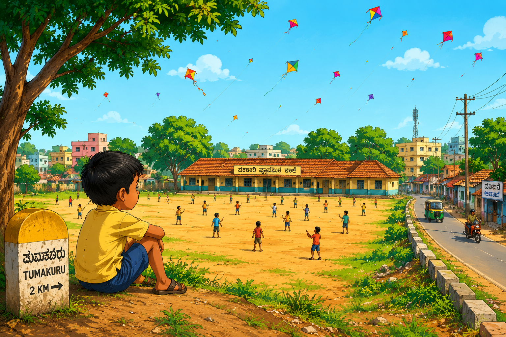
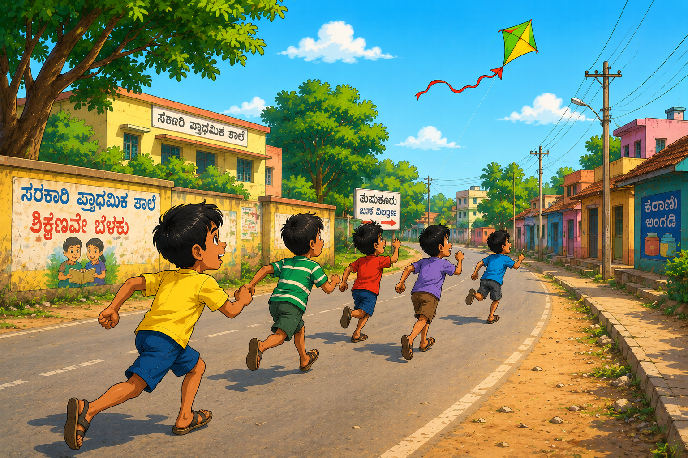
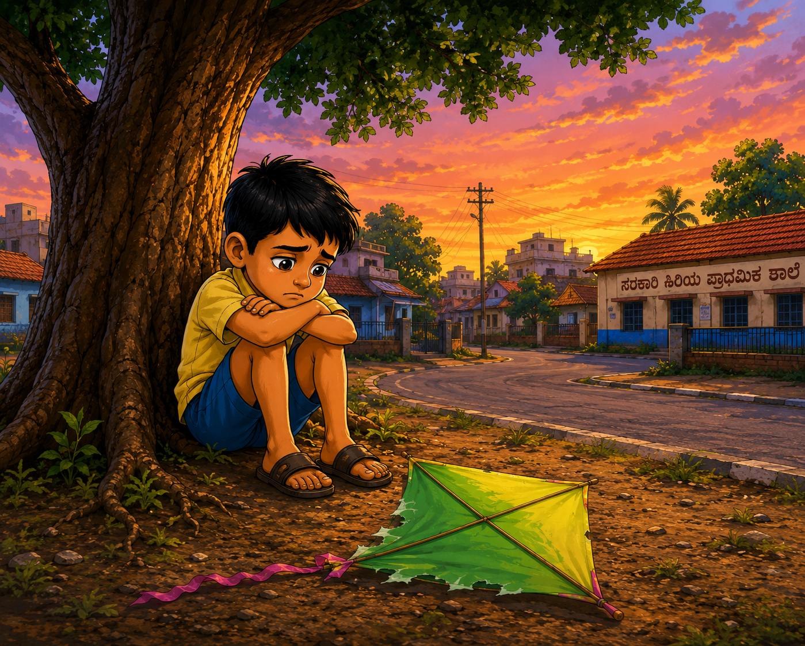
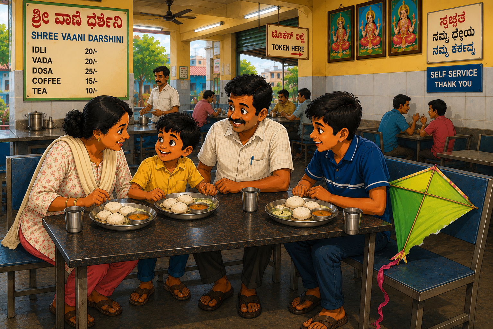

# The Kite That Flew Too Far

The January sky above Tumakuru was alive with color.

 Red kites, blue kites, yellow kites, and even one shaped like a bird floated high above the rooftops. Every now and then, two kites would cross paths, their sharp strings rubbing against each other until one thread snapped.

“Cut! Cut! Cut!” children shouted.

The defeated kite would wobble in the wind and begin a long, lazy journey across the town.

Eight-year-old Muthu stood outside his house watching the spectacle.

He did not have a kite of his own.

His elder brother Ravi had promised to teach him kite flying one day, but Ravi was busy preparing for his school exams.

So Muthu spent the afternoon doing what many children secretly enjoyed even more than flying kites—chasing the cut ones.

⸻

Suddenly, a bright green kite broke free from a battle high above.

“It’s coming this way!” someone shouted.

At once, a dozen children took off running.

Muthu ran too.

The kite floated over a row of houses.

The children followed.

It drifted past a small temple.

The children followed.

Then it crossed an open playground.

A few younger children stopped, tired and breathless.

But Muthu kept running.

The green kite dipped lower.

“So close!” he thought.

A gust of wind lifted it again.

Now only four children remained in the chase.

The kite crossed another street.

Then another.

Soon only Muthu and one older boy were still running.

The older boy finally stopped.

“Too far!” he shouted.

But Muthu refused to give up.

The green kite had become his mission.

Across a vacant lot, past a vegetable market, and beyond a cluster of houses he ran.

The kite seemed to enjoy teasing him.

Whenever he thought it would land, the wind carried it farther.

At last, near the edge of a quiet neighborhood he had never seen before, the kite lost its strength.

It drifted downward and settled gently on the branches of a small neem tree.

Muthu’s heart leaped.

He climbed carefully, reached out, and grabbed the tail.

The kite was his.

He climbed down grinning from ear to ear.

“I got it!”

For several minutes he admired the bright green paper shining in the afternoon sun.

Then he looked around.

His smile faded.

Nothing looked familiar.

The playground was gone.

The temple was nowhere to be seen.

Even the streets seemed different.

Muthu walked one way.

Then another.

Every lane looked the same.

A knot formed in his stomach.

The sun began to sink lower.

Shadows stretched across the road.

Birds flew home in noisy groups.

For the first time that day, Muthu felt very small.

He sat beneath the neem tree, clutching the green kite.

What if he never found his way back?

His eyes filled with tears.

⸻

Back at home, Amma had already begun worrying.

When Muthu did not return by evening, she asked Ravi where he had gone.

“I thought he was playing nearby,” Ravi said.

Soon the whole family was searching.

Ravi checked the playground.

Amma asked shopkeepers.

And Shivanna walked through street after street, calling out his son’s name.

“Muthu!”

But there was no answer.

As evening settled over Tumakuru, Muthu heard distant voices.

At first he paid no attention.

Then he heard it again.

“Muthu!”

He stood up.

The voice sounded familiar.

“Muthu!”

This time he knew.

It was Ravi.

Muthu jumped to his feet.

“I’m here! I’m here!”

A few moments later, Shivanna appeared at the end of the lane, followed by Amma and Ravi.

The moment he saw them, Muthu dropped the kite and ran.

“Appa!”

He threw his arms around Shivanna.

Shivanna hugged him tightly.

“Oh, are you here? We’ve been searching everywhere for you!”

Amma wiped away tears she had been trying to hide.

“Muthu, do you know how worried we were?”

Muthu lowered his head.

“Sorry, Amma.”

Shivanna noticed the green kite lying near the neem tree.

He pointed at it and smiled.

“So this is the fellow that caused all the trouble?”

Muthu nodded.

Ravi picked it up and inspected it carefully.

“It isn’t even the biggest kite in Tumakuru.”

“But I caught it,” Muthu said proudly.

Everyone laughed.

As they walked home together, the sky turned orange and gold.

Near the bus stand, they passed a small tiffin cart where fresh idlis were being lifted from steaming aluminium trays.

The smell of hot idli and coconut chutney drifted through the evening air.

Shivanna stopped.

“I think our kite hunter deserves a reward.”

A few minutes later, the family stood around the cart eating soft, steaming idlis from steel plates.

The green kite rested beside Muthu.

Its paper was slightly torn.

Its tail was tangled.

And it certainly wasn’t the biggest kite in Tumakuru.

But to Muthu, it was the finest kite in the whole town.

After all, he had chased it farther than anyone else.

And unlike the kite, he had found his way back - to Appa, Amma, Ravi and home.
