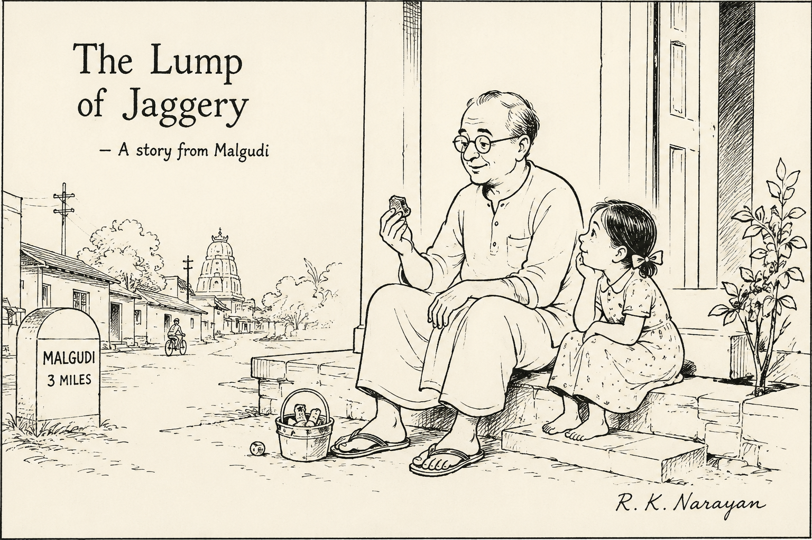

# The Lump of Jaggery

When Srinivas turned sixty-three, he discovered that evenings had become longer.

His son worked in another city. His daughter called every Sunday. His wife, a schoolteacher, returned home only after sunset. Most evenings, he sat on the front veranda of his old house, watching bycycles rattle past and listening to the distant temple bell.

One summer, a new family moved into the house next door.

Among them was a little girl named Anagha, who was four years old and possessed the astonishing confidence that only four-year-olds possess.

On the very first day, she marched into his courtyard carrying a broken plastic bucket.

"Hi," she announced, "this is my treasure box."

Srinivas peered into it.

Inside were three pebbles, a bottle cap, a feather, and what looked suspiciously like a dead leaf.

"A fine collection," he said gravely.

From that day onward, Anagha visited every evening.

Somewhere along the way, Anagha began calling him "Thatha".  Srinivas never asked why. Secretly, he liked the title far more than he cared to admit.

She would sit cross-legged beside him on the veranda while he shelled peanuts or watered the jasmine plants.

At first, she spoke endlessly.

About ants.

About clouds.

About why cats did not wear shoes.

About how her father was very tall but still could not touch the moon.

Srinivas listened as though each topic were of national importance.

One evening, when she had exhausted her supply of questions, she asked, "Thatha, what did you do when you were little?"

Srinivas smiled.

"No television."

"No tablet?"

"No tablet."

"No phone?"

"No phone."

Anagha looked genuinely concerned.

"Then what did you do all day?"

And so began the stories.

He told her about climbing mango trees and returning home with scratched knees.

About paper boats sailing down monsoon gutters.

About stealing tamarind pods from a neighbour's tree and then confessing because the guilt was heavier than the tamarind.

About flying kites that disappeared into the clouds.

Each story carried a small lesson, though he never announced it as one.

From the tamarind story she learned honesty.

From the kite story she learned that not everything we love remains with us.

From the mango tree story she learned that courage and foolishness often wear the same clothes.

After every story, Anagha would think for a moment and then declare her own conclusion.

Sometimes it matched his.

Often it didn't.

One evening she concluded that the most important lesson from the tamarind story was that pockets should be larger.

Srinivas could not argue with that.

⸻

There was another ritual.

At the end of every story, he would disappear into the kitchen and return with a small lump of jaggery.

His grandmother had done the same for him.

A story, she believed, should leave sweetness behind.

Anagha accepted the jaggery with great seriousness.

She would nibble it slowly while pondering the events of the tale.

Soon she began asking for stories first and jaggery second.

Srinivas considered this a victory.

⸻

One rainy evening, Anagha arrived unusually quiet.

She sat beside him and stared at the wet road.

"What happened?" he asked.

"My friend said my drawing is ugly."

Srinivas nodded.

The rain drummed softly on the tiled roof.

After a while he said, "Would you like a story?"

She nodded.

He told her about a clay pot made by a village potter. The pot leaned slightly to one side and looked imperfect beside the others.

Nobody bought it.

Years later, a woman purchased it cheaply and used it to grow a flowering plant. Because the pot leaned, the flowers spilled beautifully over the edge.

The crooked pot became the prettiest thing in her courtyard.

When the story ended, Anagha was silent.

Then she asked, "Did the pot know it was pretty?"

"No," said Srinivas.

"Then somebody should have told it."

And just like that, her sadness vanished.

⸻

One evening, after a particularly long animated story about a monkey that stole mangoes in the village, Anagha stood up, dusted her skirt, and announced that she had to go home before her mother came looking for her.

Before leaving, she turned back.

"Tomorrow, tell me the mango tree story again, Thatha."

"I've already told you that one three times."

"I know," she said. "But tomorrow tell it differently."

And with that she skipped away.

Srinivas sat on the veranda for a while longer.

The jasmine flowers were beginning to release their fragrance.

The lane was quiet except for the occasional bicycle bell.

For many years, evenings had seemed longer than he liked.

There was always another hour to fill, another sunset to watch alone.

Now, as he rose to go inside, he found himself wondering what story he would tell tomorrow.

A curious thing had happened.

The evenings had not become any shorter.

They had simply become something to look forward to.

And somewhere next door, a little girl was probably wondering whether the mangoes would taste sweeter in tomorrow's version of the story.

The next evening, Srinivas was on the veranda ten minutes earlier than usual.
