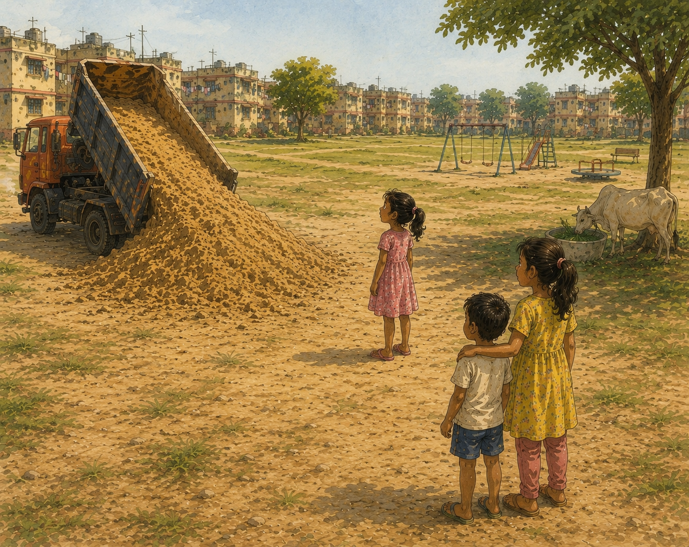
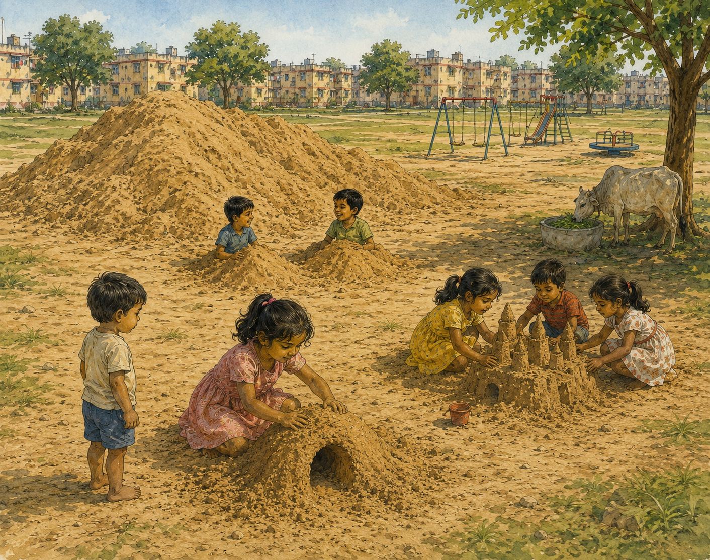
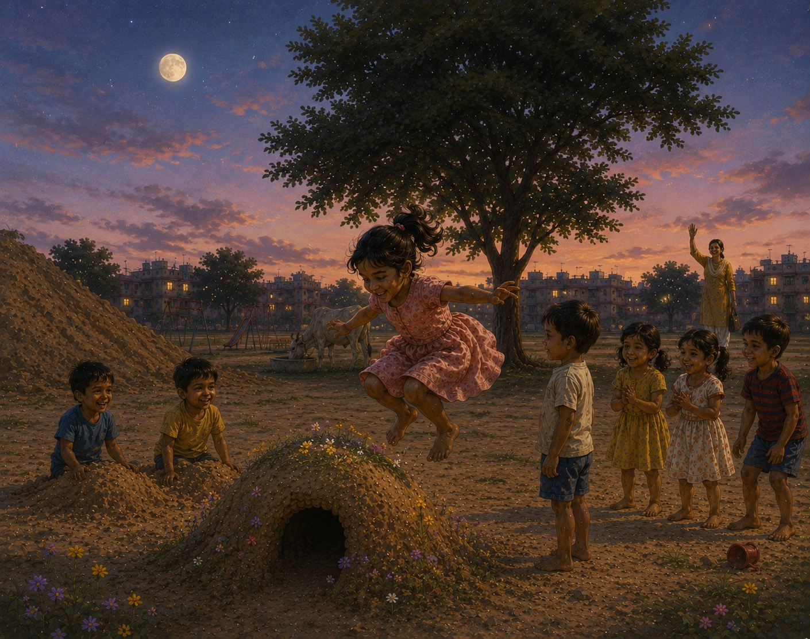
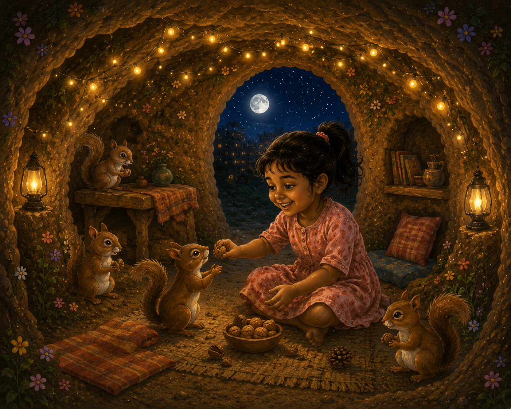

# The Sand Cave

One sunny afternoon, a truck rumbled into the playground beside the Bokaro quarters.

The children stopped their games and stared.

The truck slowly lifted its bed and poured out a huge mountain of golden sand.

“Wow!” whispered five-year-old Anu.

The pile looked enormous, almost like a tiny hill that had appeared overnight.

Soon children from all the nearby quarters came running. Some stood with their hands on their hips, imagining what they would build. Others circled the sand mountain, searching for the perfect spot.

The truck drove away, leaving behind two giant heaps of soft sand.

The playground became a kingdom of imagination.

Three children worked together on a grand castle with towers and walls.

Two boys buried their legs in the sand and pretended they were growing out of the ground like trees.

And Anu had her own special plan.

“I’m making a cave,” she announced.

Using only her hands, she scooped and patted the sand carefully. Handful by handful, she shaped a little dome. Slowly it began to look like a tiny igloo.

A younger boy stood nearby, watching her work.

“Will someone live in there?” he asked.

“Maybe,” said Anu with a smile.

When the cave was finished, Anu wandered around the playground looking for tiny wildflowers. She found little yellow flowers, purple flowers, and tiny white blooms growing near the fence.

One by one, she pressed them into the sand around the cave.

Then she made a narrow road leading to the entrance.

Along both sides of the road she planted more flowers like a colorful sidewalk.

Her cave looked magical.

The sky turned orange and purple as the sun began to set.

A pale moon appeared above the playground.

Then a familiar voice called across the field.

“Anu! Dinner time!”

Anu looked up.

Her mother was standing near a tree, waving.

Other mothers and fathers were calling too.

The children exchanged knowing smiles.

This was the best part.

One by one they jumped on their creations.

Crash!

The castle collapsed.

Thump!

The mountains flattened.

The boys kicked away the sand covering their legs.

And then Anu took a running start.

Her friends gathered around her flower-covered cave.

Ready…

Steady…

Jump!

Anu flew through the air and landed right on top of her beautiful cave.

The little igloo crumbled into a pile of sand.

Everyone burst out laughing.

Hand in hand, they headed home.

That evening Anu ate a delicious dinner of rice, dal, and potato fry. She happily told her parents about the castle, the buried legs, and her flower-covered cave.

After dinner she brushed her teeth, changed into her pajamas, and climbed into bed.

Outside her window, the moon shone softly.

Within minutes she was asleep.

And then she began to dream.

In her dream, the sand cave was still there.

But now it was much bigger.

Big enough to live in.

The walls sparkled with tiny flowers.

Warm golden lights glowed from inside.

A cozy little bed sat near the entrance.

And all around her were squirrels.

Friendly squirrels.

Playful squirrels.

They chased each other around the cave, shared nuts with Anu, and curled up beside her.

One squirrel sat on her shoulder.

Another brought her a flower.

A third invited her to play hide-and-seek among the winding tunnels.

Anu laughed and laughed.

It was the happiest cave in the world.

As the moon shone over the magical flower-covered cave, Anu and her squirrel friends played together long into the night.

And when morning came, she woke with a smile.

Because she knew that after school, there was still a sand in the playground.

And perhaps one more cave waiting to be built.

Every afternoon the children returned.

They built castles.

They built mountains.

They buried their legs.

They made roads and forts and tiny villages.

Each day the sand pile became a little smaller as workers carried sand away to build the nearby house.

But nobody worried.

Tomorrow they would build something new.
