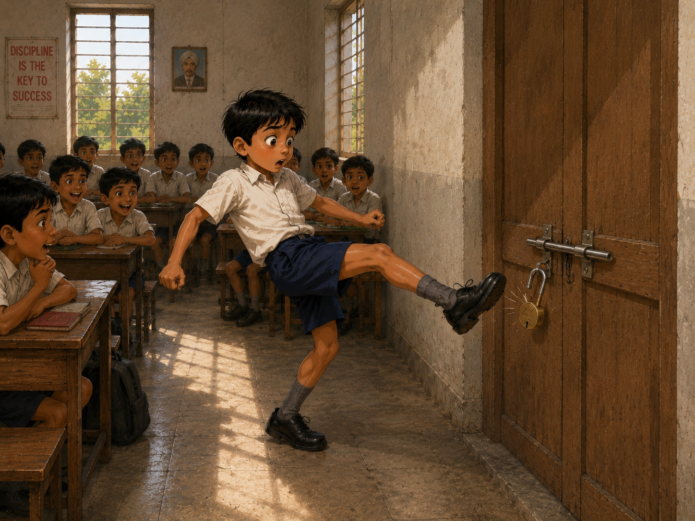
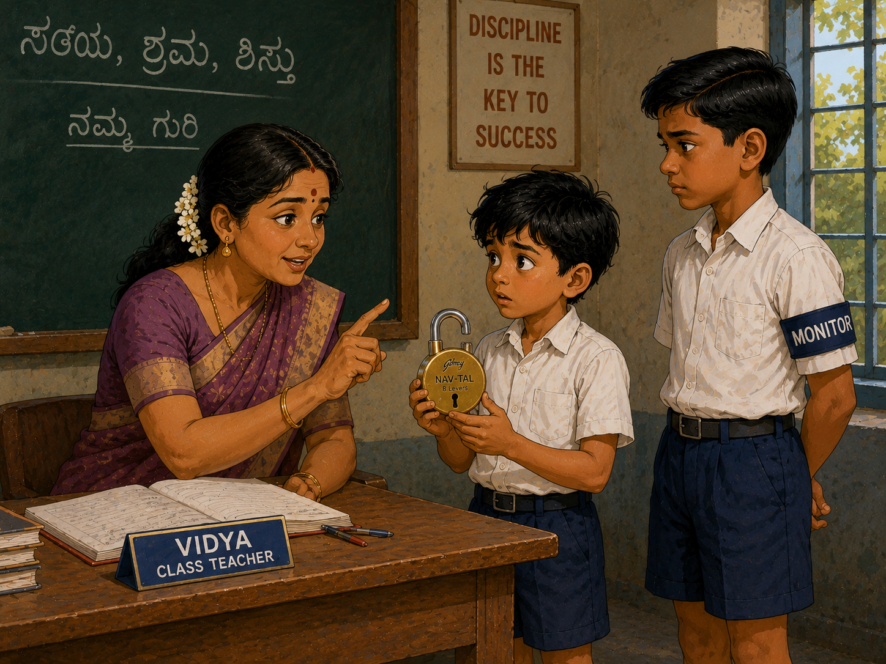
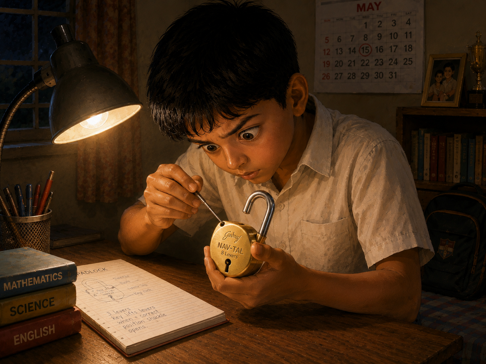

# The Lock That Wouldn’t Stay Locked

Vivek studied in Class Five. He loved football so much that he could never stop thinking about it.

One Tuesday afternoon, the teacher had not yet arrived after lunch. The classroom buzzed with chatter. Some children were reading comics under their desks. Others were exchanging marbles and stickers.

Vivek and two friends were pretending to play football using a crumpled paper ball.

“Pass!” shouted one boy.

Vivek trapped the paper ball with his shoe.

“Watch this!” he said.

He took a small step back and swung his leg gently, imagining himself scoring the winning goal in a big stadium.

The paper ball flew away.

But his shoe also brushed against the padlock hanging from the wooden doors of the classroom cupboard built into the wall.

Click!

The lock suddenly sprang open.

For a moment, everyone stared.

The lock dangled from the latch with its shackle sticking up.

“Oh no!” whispered Vivek.

Just then, the class monitor, Arun, walked in.

“I saw that,” he said.

A few minutes later, their class teacher, Vidya Madam, entered the room.

Arun immediately reported what had happened.

Vidya Madam examined the lock carefully. She opened it and tried to close it again.

The shackle would not stay locked.

Something inside had come loose.

She looked at Vivek.

“Vivek, this lock belongs to the school.”

Vivek lowered his head.

“You must either get it repaired or bring a new lock tomorrow.”

The classroom became silent.

“Yes, Madam,” he said softly.

All the way home, Vivek carried the lock in his school bag.

He was afraid to tell his parents.

If he told them about the lock, he would also have to explain why he had been playing football inside the classroom.

At dinner, he hardly spoke.

His mother asked, “Are you feeling alright?”

“Yes,” he replied quickly.

That night, after everyone had gone to sleep, Vivek took the lock from his bag.

He sat at his study table under the yellow light of his lamp.

The round brass lock looked perfectly fine from the outside.

Yet something inside rattled whenever he shook it.

He turned it over and over in his hands.

Then he noticed a tiny hole near the shackle.

Curious, he inserted a thin metal nail into the hole.

Nothing happened.

He tried again.

A tiny metal piece seemed to move.

He pushed a little more carefully.

Click!

The loose piece suddenly slipped into place.

Vivek froze.

He pressed the shackle down.

Click!

The lock closed.

His eyes widened.

He pulled the shackle.

It stayed locked.

He opened it again.

Closed it again.

Opened it once more.

Perfect.

A huge smile spread across his face.

The next morning, Vivek hurried to school.

The repaired lock rested proudly in his hand.

When Vidya Madam entered the classroom, Vivek stepped forward.

“Madam, I fixed it.”

The entire class turned to look.

Vidya Madam took the lock and tested it several times.

Open.

Close.

Open.

Close.

Everything worked.

A smile appeared on her face.

“Well done,” she said.

Vivek felt lighter than air.

But then she added,

“Next time, play football in the playground, not in the classroom.”

The whole class burst into laughter.

Even Arun the monitor laughed.

Vivek laughed too.

From that day onward, whenever he felt tempted to practice football indoors, he remembered the long night spent worrying about a stubborn lock.

And the classroom cupboards were never kicked again.

The End
