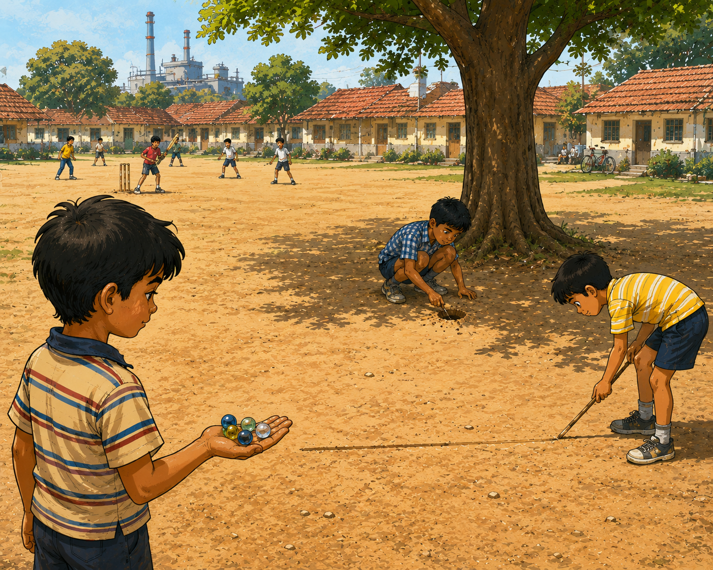
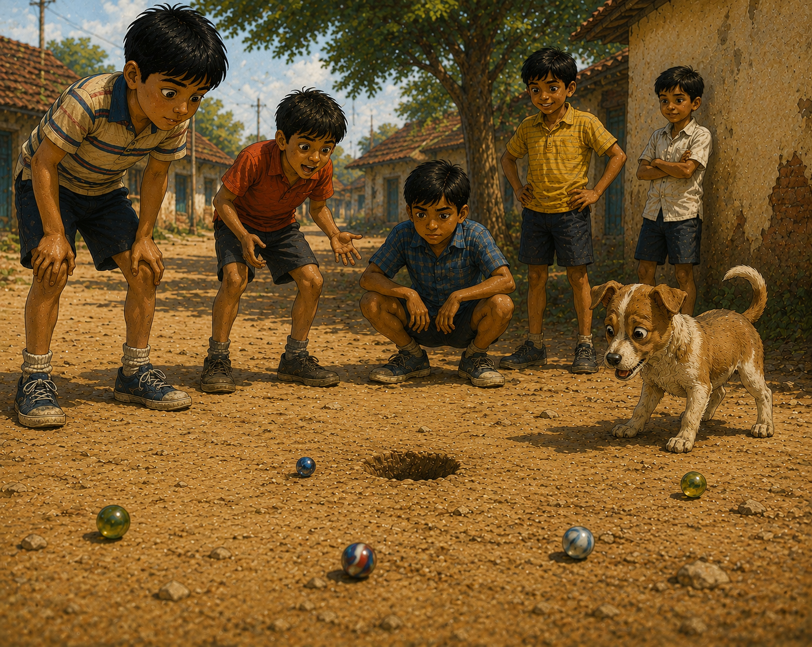
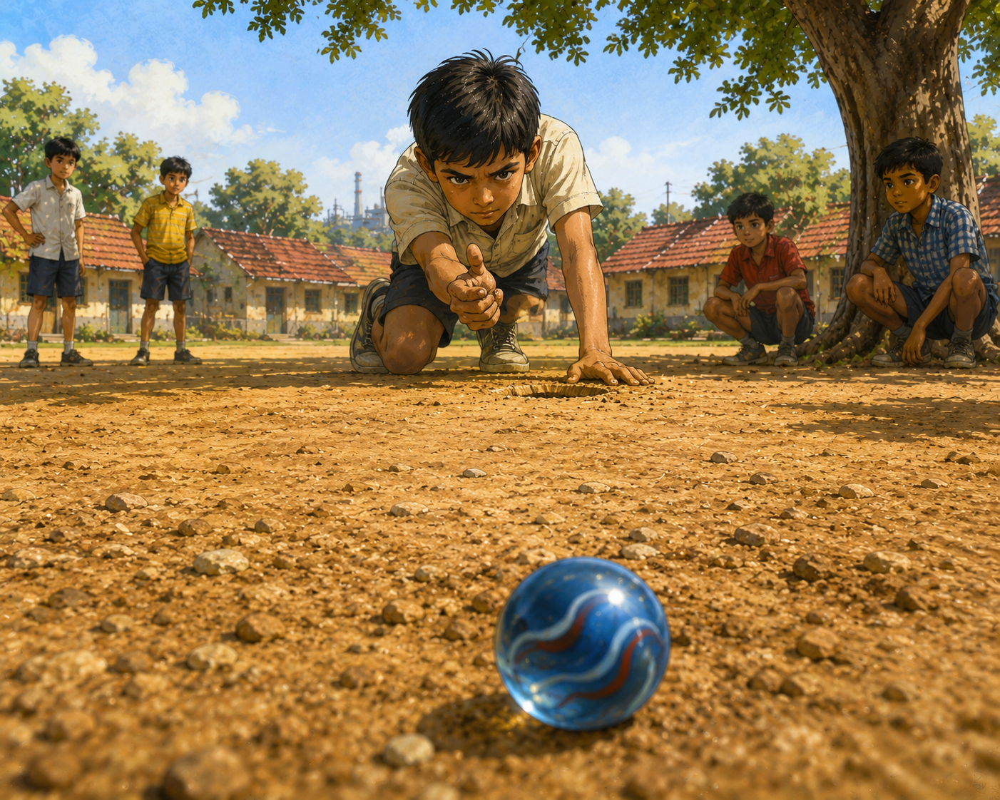
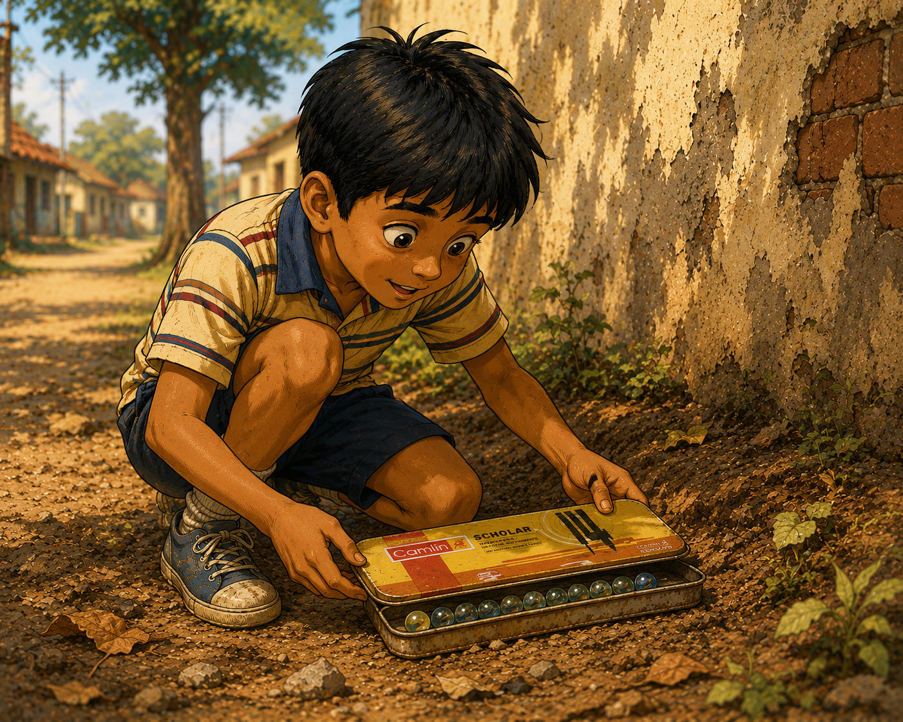

# The Marble Treasure

The company quarters stood in neat rows around a large dusty playground in Rourkela.

Every block looked almost the same. Cream-colored walls, red-tiled roofs, and small gardens filled with hibiscus and jasmine. Narrow footpaths connected one row of houses to another. Beyond the trees, the tall chimneys of the steel plant stood against the bright afternoon sky.

The playground was the heart of the colony.

Children gathered there every evening.

Older boys played cricket near one corner. A group of girls skipped rope beneath a gulmohar tree. Toddlers chased each other around a hand pump.

And under the largest neem tree, five boys were preparing for a serious game of Pilla Goti.

 Vikas arrived with four marbles jingling in his pocket. That was his entire collection.
There was a green marble, a yellow marble, a smoky gray marble, and his favourite—a blue marble with a white swirl trapped inside.

“Only four?” laughed Viru.

“That’s enough,” said Vikas confidently.

“We’ll see about that,” said Tiwari.

Prashant knelt down and shaped a small bowl-like hole in the dirt.

The Gutti.

A few feet away, he drew a line.

The boys would flick their marbles from behind the line to decide who played first.

Everyone knew the rules.

Landing a marble inside the Gutti earned ten points.

Hitting another player’s marble earned five.

To continue a turn, a player had to return to the Gutti.

The first player to reach one hundred points won the game.

And at the end, every loser handed over one marble to the winner.

“Ready?” asked Alok.

Five heads nodded.

One by one, the boys flicked their marbles toward the Gutti.

Viru overshot.

Prashant landed close.

Vikas landed even closer.

Then Tiwari’s marble rolled neatly into the Gutti.

Plop.

“First turn!” he announced.

The game began.

Tiwari scored ten points immediately and tried for a difficult hit.

Miss.

His turn ended.

Alok stepped forward.

His marble dropped into the Gutti.

Ten points.

Then he struck Viru’s marble.

Five more.

Back into the Gutti.

Another ten.

The boys groaned.

Alok was on a roll.

For nearly twenty minutes, the score bounced back and forth between the players.

Prashant played carefully.

Viru played loudly.

Tiwari played confidently.

Vikas played hopefully.

In the end, Alok reached one hundred first.

“Winner!” shouted Viru.

The boys reached into their pockets.

Vikas handed over his yellow marble.

Three remained.

The afternoon rolled on beneath the neem tree.

Dust rose.

Marbles clicked.

Arguments came and went.

Prashant won the next game.

Viru somehow won the game after that and celebrated as though he had conquered the world.

Even Tiwari claimed a victory.

With each game, Vikas’s collection grew smaller.

First the gray marble disappeared.

Then the green one.

By evening, only the blue marble remained.

The one with the white swirl.

The one he liked best.

The sun had begun sinking behind the rows of quarters.

Long shadows stretched across the playground.

“One last game,” said Viru.

Nobody wanted to go home yet.

So they started again.

This time the game was close.

Very close.

As the sky turned orange, Tiwari pulled ahead.

Ninety points.

Ninety-five.

The others tried to catch him.

But Tiwari stayed in front.

Now he needed just five more points.

One successful hit.

That was all.

The boys gathered around the Gutti.

Even the cricket game at the far end of the playground seemed quieter.

Vikas’s blue marble rested several feet away near a small patch of dry grass.

Tiwari crouched beside the Gutti.

He placed his thumb firmly against the edge of the hole and balanced his shooter marble against his index finger.

The shot looked impossible.

There were pebbles in the way.

Tiny grooves in the dirt.

And Vikas’s marble sat at an awkward angle.

Nobody said a word.

Tiwari narrowed his eyes.

Then—

Tick!

His finger snapped forward.

The shooter shot out of the Gutti.

A tiny puff of dust followed it.

At first it rolled straight.

Then it began to spin.

The marble curved gently across the ground.

Around a pebble.

Along a shallow groove.

Still spinning.

Still turning.

The boys stared.

“Look at that!” whispered Prashant.

The marble seemed almost alive.

Then -

Click!

It struck Vikas’s blue marble perfectly.

The blue marble jumped and rolled away.

For a moment, there was silence.

Then the playground exploded.

“Five points!”

“Tiwari wins!”

“What a shot!”

“I’ve never seen anything like that!”

Even Viru stood open-mouthed.

Tiwari smiled quietly.

He knew it had been a special shot.

Vikas looked at the two marbles resting side by side.

The shot had been beautiful. But it had also ended the game.

Slowly, he reached into his pocket.

His fingers found the blue marble.

For a moment he held it tightly.

Then he placed it in Tiwari’s hand.

His pocket was empty.

The boys began drifting home.

Vikas walked slowly behind the rows of quarters.

The evening breeze carried the smell of cooking from open windows.

Somewhere a pressure cooker whistled.

Someone called a child in for dinner.

Vikas kicked a small stone.

Clink.

He stopped.

That didn’t sound like a stone.

Looking down, he noticed the corner of a rusted tin sticking out of the loose soil behind one of the quarters.

Curious, he knelt down.

A few minutes later he pulled the tin free. The lid was stiff, but it opened. Vikas stared. Inside were marbles. Lots of marbles. Blue ones. Green ones.  White ones. Amber ones.

He counted them carefully.

Twenty.

Twenty beautiful marbles.

His eyes grew wider with every count.

Just an hour earlier he had owned none.

Now he owned twenty.

Vikas hugged the tin against his chest and ran home as fast as he could.

The next evening, the boys gathered once again beneath the neem tree.

Alok arrived first.

Then Prashant.

Then Viru.

Then Tiwari.

Finally Vikas appeared.

The others noticed the tin immediately.

“What is that?” asked Viru.

Vikas grinned.

Without a word, he opened the lid.

Twenty marbles sparkled in the morning light.

The boys gasped.

For a moment, nobody spoke.

Yesterday, Vikas had been the poorest marble player in the colony.

Today, he was the richest.

And before long, the familiar sounds returned beneath the neem tree.

Click.

Clack.

Laughter.

Arguments.

And another game of Pilla Goti.
