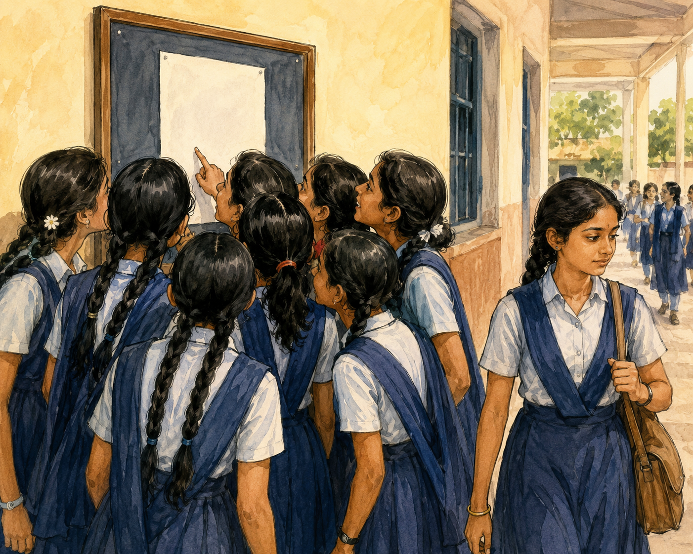
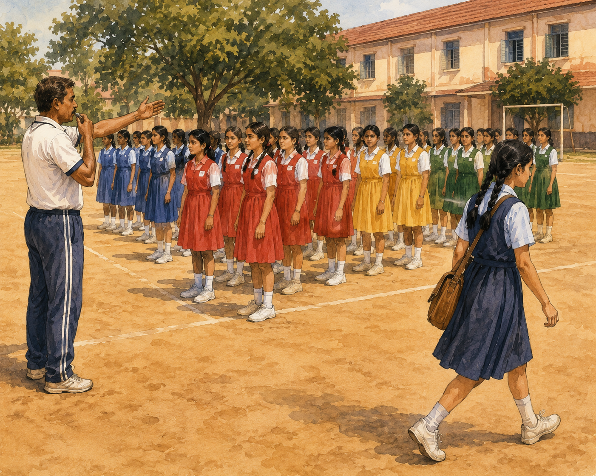
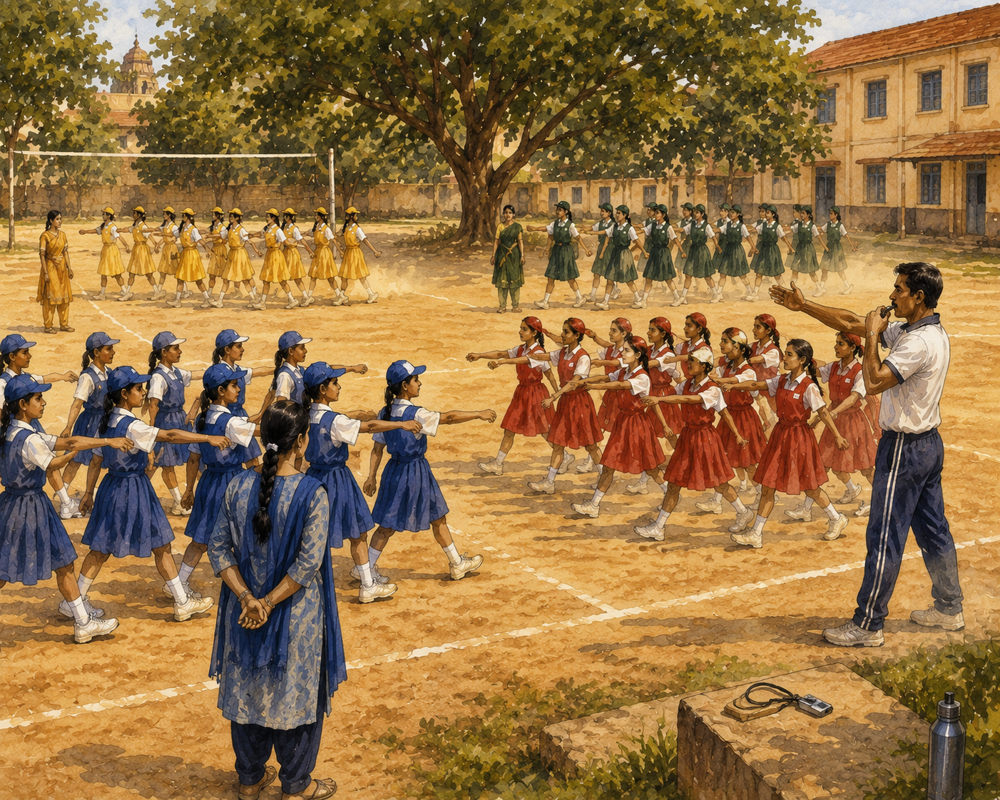
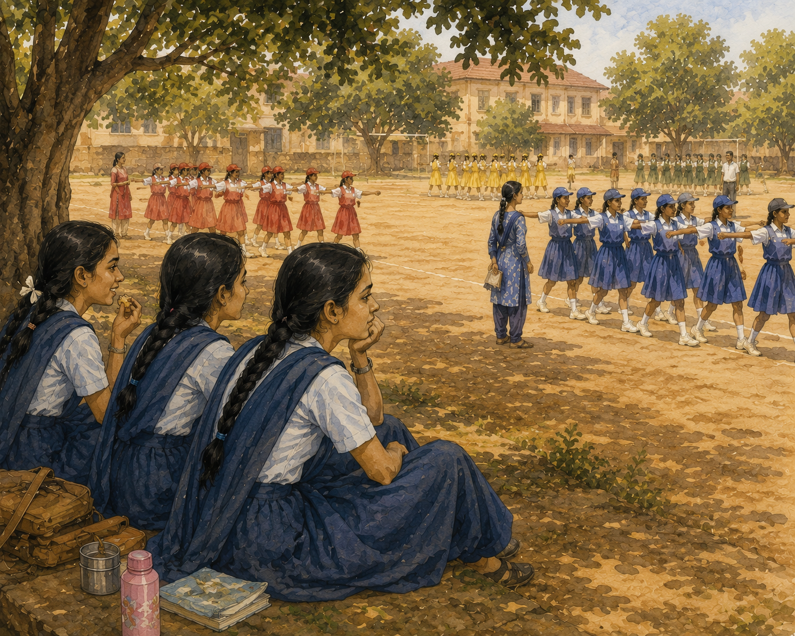
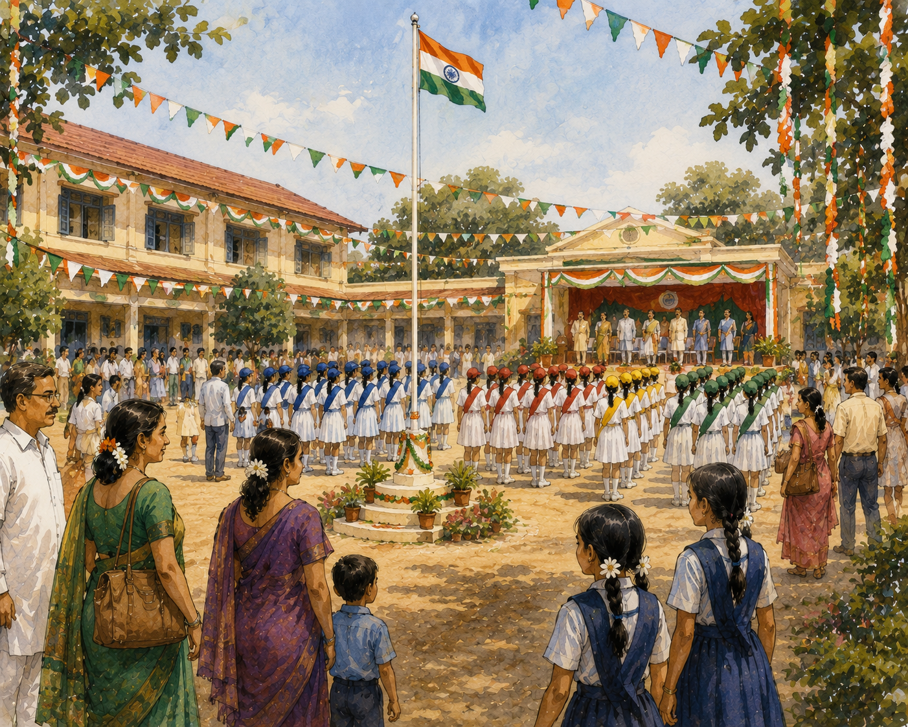
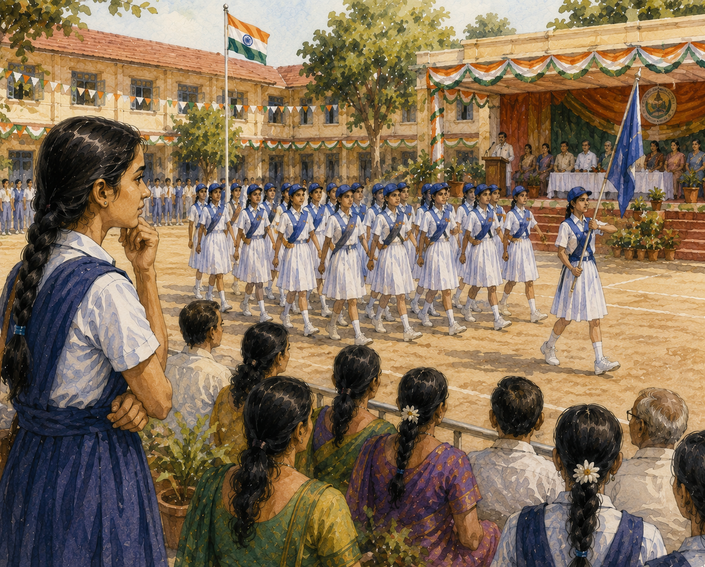
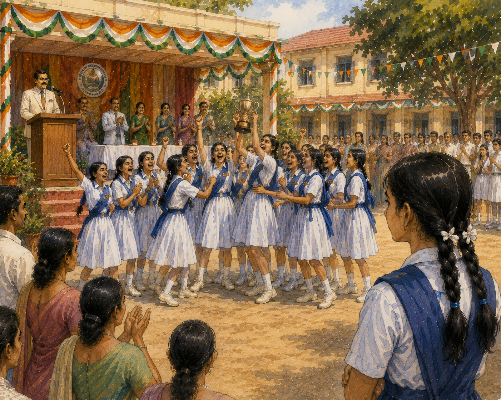
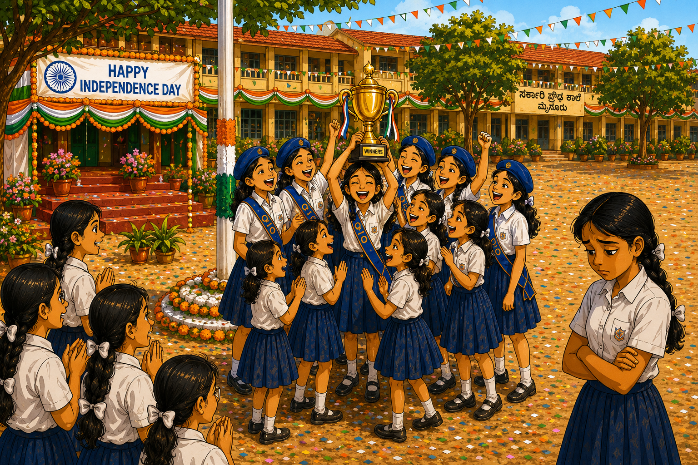
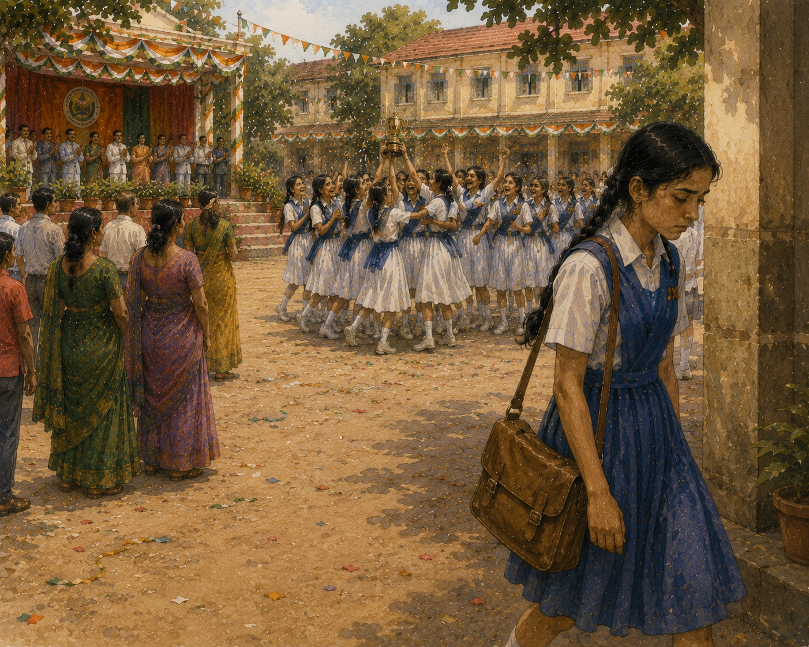
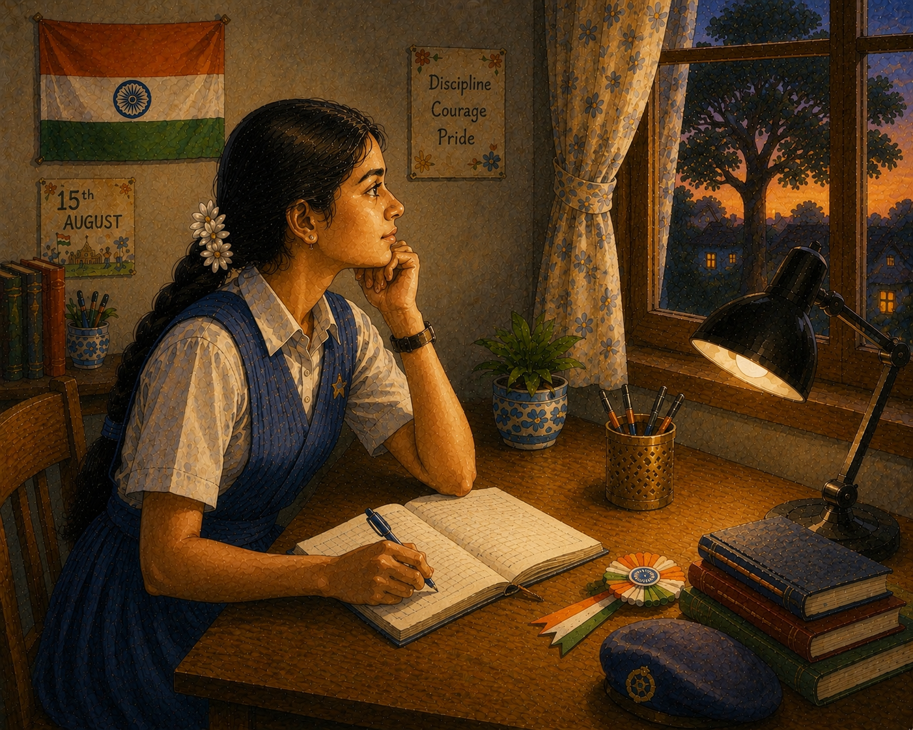

# Padma and Parade

The first week of August brought a special excitement to Government High School in Mysuru.

The classrooms were decorated with tricolour paper chains. Small flags fluttered from windows. Every morning, teachers reminded students that Independence Day was just around the corner.

One afternoon, the sports teacher pinned a notice on the school notice board.

Parade Selection – 2:00 PM

Students gathered around the board, reading it eagerly.

“Fifteen days of practice!” exclaimed one girl.

“I’m definitely joining,” said another.

Padma glanced at the notice while walking past.

Fifteen days of practice?

Every evening?

She shook her head and continued towards her classroom.

That afternoon, students from all four houses assembled on the playground for selection.

Padma did not even stop to watch.

⸻

The next day, parade practice began.

Every evening, the large playground came alive with whistles, commands and marching feet.

Blue House practised near the banyan tree.

Yellow House marched beside the volleyball court.

Red House occupied the centre of the ground.

Green House trained near the far boundary.

House teachers patiently guided their groups.

“Left… right… left… right!”

Dust rose from the ground as dozens of students marched under the evening sun.

Padma often sat under a tree with a few friends who had not joined the parade.

From there she watched the practice sessions.

Some groups marched in perfect rhythm.

Others looked completely confused.

A few girls were always out of step.

Sometimes entire rows marched in different directions.

Padma smiled.

“See? Good thing we didn’t join.”

Her friends nodded.

The practices continued day after day.

⸻

Soon Independence Day arrived.

The school looked beautiful.

Tricolour decorations hung from every building.

The flag post stood proudly in the centre of the ground.

Parents, teachers and guests filled the campus.

The parade girls looked completely different from practice days.

They wore crisp white uniforms.

Each house wore colourful caps and sashes.

The house flags fluttered proudly in the breeze.

Padma stood near the spectators’ area and watched.

One house after another marched past the flag post.

As each team saluted the chief guests and turned neatly around the parade track, Padma silently judged them.

“Their line isn’t straight.”

“The Red House looks better.”

“The Green House is marching faster.”

“The Blue House is not that impressive.”

Whenever she noticed a small mistake, she felt a little better about not joining.

⸻

Finally the parade competition ended.

The students assembled near the stage.

The judges discussed the results.

Everyone waited eagerly.

Third Prize.

A cheer rose from one corner.

Second Prize.

Another group celebrated.

Padma looked around.

Only Blue House remained.

Her house.

Suddenly she felt nervous.

The headmaster stepped forward with the microphone.

“And the First Prize for Best Parade goes to…”

He paused.

“Blue House!”

The ground erupted with cheers.

Girls jumped with excitement.

Teachers clapped.

House captains waved their flags proudly.

Padma stood frozen.

Blue House?

Her house?

The same group she had spent the morning criticising?

⸻

Soon the parade girls gathered near the flag post.

Someone lifted the shining trophy high into the air.

The girls cheered.

They laughed about funny moments from practice.

One remembered the day a cap flew away in the wind.

Another remembered missing a marching command and making everyone laugh.

Their house teacher smiled proudly.

Padma stood nearby watching.

One of her friends from Blue House spotted her.

“Padma!” she called happily.

“We won!”

“I saw,” said Padma with a smile.

“You should have joined us,” her friend said. “Practice was hard at first, but it became so much fun.”

Padma nodded.

She watched the girls crowd around the trophy.

They were not just celebrating a victory.

They were celebrating fifteen days of memories she did not have.

For the first time, Padma understood what she had missed.

Not the trophy.

Not the prize.

The journey.

As she walked home that evening through the decorated streets of Mysuru, she made a quiet promise to herself.

Next year, when the notice appeared on the board, she would not walk past it.
